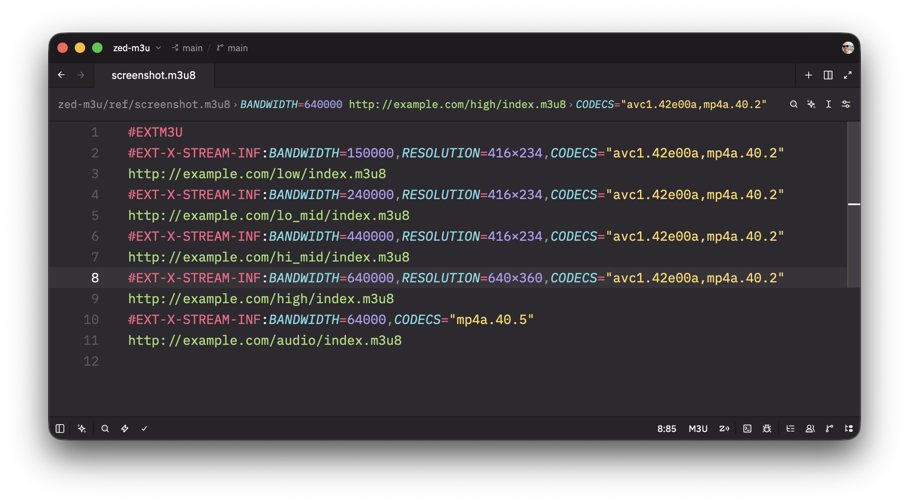

# M3U for Zed

[M3U](https://en.wikipedia.org/wiki/M3U) playlist support for
[Zed](https://zed.dev): plain and Extended M3U, IPTV lists and
[HTTP Live Streaming](https://developer.apple.com/streaming/) (HLS), in both
`.m3u` and UTF-8 `.m3u8` files.



<sub>Shown with the Zedokai Darker theme.</sub>

## Features

- **Syntax highlighting** for directives, attribute lists, quoted strings,
  enumerated values (`AUDIO`, `PQ`, `AES-128`), numbers (including
  resolutions and hexadecimal), timestamps, media URIs, comments and
  `{$variable}` substitution
- **Typos stand out**: tag and attribute names that the specifications don't
  define are shown as plain text, so `BANDWDTH` or `#EXT-X-TARGETDURATON`
  catch your eye. Client-defined `X-` attributes and lowercase dialect
  attributes (`tvg-id`) are highlighted normally
- **Full HLS coverage**, including every tag in
  [draft-pantos-hls-rfc8216bis-22](https://datatracker.ietf.org/doc/html/draft-pantos-hls-rfc8216bis-22)
  (1 May 2026; the WWDC 2026 edition adds no tags): Low-Latency HLS
  (`EXT-X-PART`, `EXT-X-SERVER-CONTROL`, …), content steering, date ranges and
  variable definitions. Tags from later revisions or vendors parse too
- **Extended M3U dialects**: `#EXTINF` titles, `#PLAYLIST`, `#EXTGRP`, M3A,
  VLC options and IPTV `tvg-*` attributes
- **Outline** (`cmd-shift-o` and the outline panel): variant streams by
  bandwidth, with their codecs, supplemental codecs, resolution, video range,
  rendition groups and URI nested below, so SDR, HDR10, HLG and
  Dolby Vision ladders are easy to tell apart; renditions by type, with
  group and name; I-frame streams; date ranges with class, dates and
  duration; `#EXTINF` titles, segments, plain entries and IPTV groups
- **Snippets** for `#EXTM3U`, `#EXTINF` and 22 HLS tags. HLS snippets are
  named `x-` plus the tag name, lowercased: `x-stream-inf`, `x-media`,
  `x-key`, `x-daterange`, `x-part`, …
- **Editing**: auto-closing quotes and braces, `cmd-/` to comment out and
  uncomment lines, directives included, and Enter continues comments but
  never directives

The grammar is [tree-sitter-m3u](https://github.com/mlinder/tree-sitter-m3u).

## Installation

Open the Extensions page (`zed: extensions`), search for **M3U** and click
**Install**. Files ending in `.m3u` or `.m3u8`, and files without those
extensions whose first line is `#EXTM3U`, are recognized automatically.

## Settings

The language is called `M3U` in Zed's settings. HLS attribute lists get
long, so soft wrapping can help, and `file_types` assigns M3U to other
files:

```json
{
  "languages": {
    "M3U": { "soft_wrap": "editor_width" }
  },
  "file_types": {
    "M3U": ["**/manifests/*.txt"]
  }
}
```

## Known limitations

- This is syntax highlighting, not validation: unknown names are shown as
  plain text rather than reported as errors, and values aren't checked.
- Vendor tags such as `#EXT-X-CUE-OUT` also show as plain text, since no
  specification defines them.
- `cmd-/` works line by line. Zed decides what is commented by the leading
  `#` alone, which directives have too, so with several lines selected it
  can comment out only the first directive, or uncomment directives by
  removing their `#`.
- M3U has no block comments.

## Development

1. Clone this repository and
   [tree-sitter-m3u](https://github.com/mlinder/tree-sitter-m3u).
2. To try local grammar changes, point `[grammars.m3u]` in `extension.toml` at
   your checkout, e.g. `repository = "file:///path/to/tree-sitter-m3u"`.
   Zed builds the grammar from a commit, so commit your changes (including the
   regenerated `src/`) and set `rev` to that commit's SHA; a branch name can
   leave a stale checkout. Delete this repository's `grammars/` folder (Zed's
   build cache) whenever the repository URL changes.
3. In Zed, run `zed: install dev extension` and select this directory. After
   changing queries, snippets or `rev`, click **Rebuild** on the M3U
   extension in the Extensions page. Check `zed: open log` if something
   doesn't load.


## License

[MIT](LICENSE)
